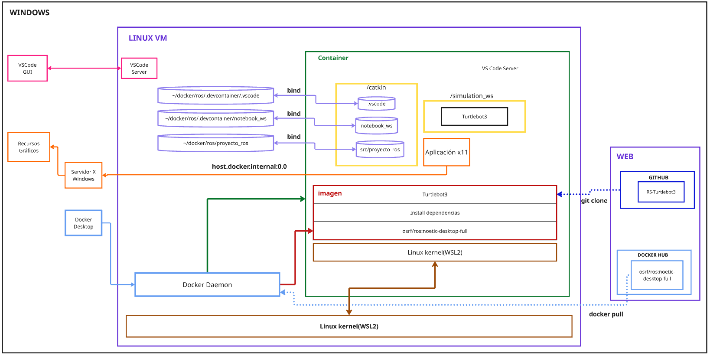
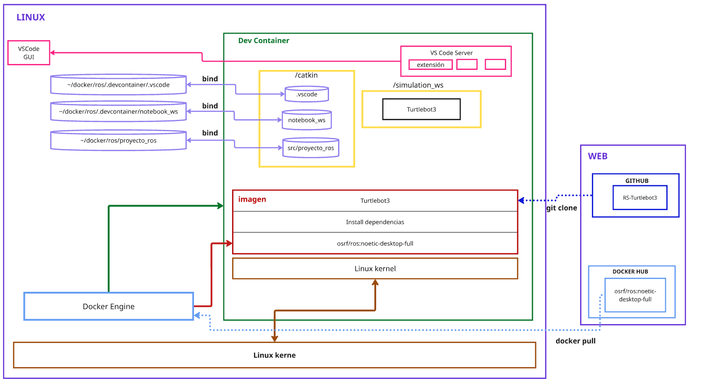

# Arquitectura de Integración: ROS + Docker + GitHub

Todo el contenido se encuentra en las ramas creadas para cada versión específica de ROS.
## Arquitecturas

### Arquitectura para Windows con WSL2

### Arquitectura para Linux Nativo

## Comparativa de Ambientes

| Característica          | Windows/WSL2                  | Linux Nativo               |
|-------------------------|-------------------------------|----------------------------|
| Rendimiento             | 80-90% de Linux               | Máximo rendimiento         |
| Soporte GPU             | Requiere drivers       | Soporte completo           |
| Soporte gráfico         | Necesita X server externo     | Integrado                  |
| Facilidad de setup      | Moderado (3-5 pasos)          | Simple (1-3 pasos)         |
| Compatibilidad hardware | Limitada (USB, dispositivos)  | Completa                  |

## Estructura del Repositorio por Versiones de ROS
El proyecto organiza su desarrollo en ramas específicas para cada distribución de ROS:
- `ros-foxy`: Versión Foxy Fitzroy (LTS)
- `ros-noetic`: Versión Humble Hawksbill (LTS)
- `ros-humble`: Versión Rolling Ridley (en desarrollo)
