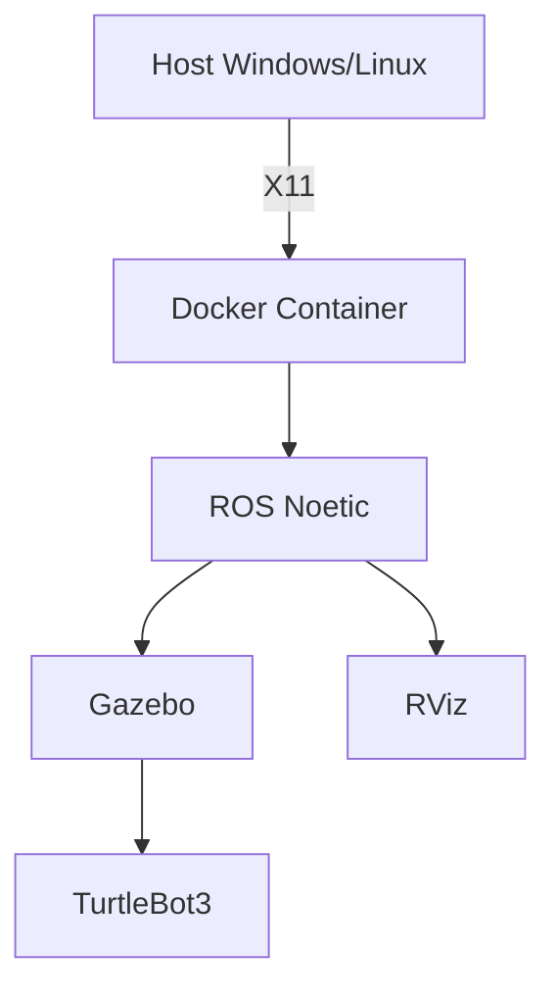

# 🐳 Docker para ROS Noetic - Conceptos Básicos (The Construct)  
**Rama actual:** `ros-noetic`  


---

## 🖥️ **1. Configuración para Windows**  

### 📋 **1.1 Requisitos**  
| Software | Enlace |
|----------|--------|
| WSL2 | [Instalación](https://aka.ms/wsl2-install) |
| Docker Desktop | [Descarga](https://docs.docker.com/desktop/setup/install/windows-install/) |
| Xming Server  | [Descarga](https://sourceforge.net/projects/xming/) |
| Visual Studio Code  | [Descarga](https://code.visualstudio.com/) |


### 📥 **1.2 Clonar Repositorio**  
```bash
# Crear carpeta de trabajo
mkdir -p ~/docker/ros-conceptos-basicos
# Ir a mi carpeta de trabajo
cd ~/docker
# Clonar repositorio
git clone -b ros-noetic https://github.com/morg1207/RS-Docker-Turtlebot3.git ~/docker/ros-conceptos-basicos
```

### 🐋 **1.3 Construcción del Entorno Docker**  

1. 🔨 **Compilar Imagen**  
```bash
#Ir a la carpeta de archivos
cd ~/docker/ros-conceptos-basicos
# Construir imagen
sudo docker compose build 
```

2. 🚀 **Ejecutar Contenedor**  
```bash
# Eliminar contenedor si ya existe
sudo docker container rm cont_ros_noetic_turtlebot3
# Ejecutar docker compose 
sudo docker compose up
```


## 🤖 **3. Simulación con TurtleBot3**  

### 📂 **3.1 Ejecutar Simulación**  
```bash
# Ejecutar un terminal dentro del contenedor
docker exec -it cont_ros_noetic_turtlebot3s bash
# Ir a mi carpeta de simulación
cd /simulation_ws
# Configurar el espacio de trabajo
source devel/setup.bash
# Lanzar el launch de la simulación
roslaunch realrobotlab main.launch
```

## 🐧 **4. Configuración para Linux**  

### ✨ **Diferencias Clave**  
```bash
export DISPLAY=:0
xhost +local:docker
docker compose -f docker-compose.linux.yml up
```

### 🔧 **Solución de Problemas Comunes**  
```bash
# Si falla X11:
sudo apt install xauth libgl1-mesa-glx
```

---

## 📌 **5. Diagrama de Arquitectura**  


---

## 📎 **Anexos**  
1. [Cheatsheet ROS Noetic](https://cheatsheet.dennyzhang.com/cheatsheet-ros-a4)  
2. [Documentación Oficial TurtleBot3](https://emanual.robotis.com/docs/en/platform/turtlebot3/overview/)  

*(Incluye aquí capturas reales de tu simulación funcionando)*  

--- 

**Nota:** Todos los comandos asumen que estás en la raíz del proyecto. Para soporte técnico, contacta a [tu-email@dominio.com].  

--- 

✨ **Tips Profesionales:**  
- Usa `docker compose logs` para depuración  
- Añade un vídeo corto (GIF) mostrando la simulación en acción  
- Incluye un QR que enlace al repositorio